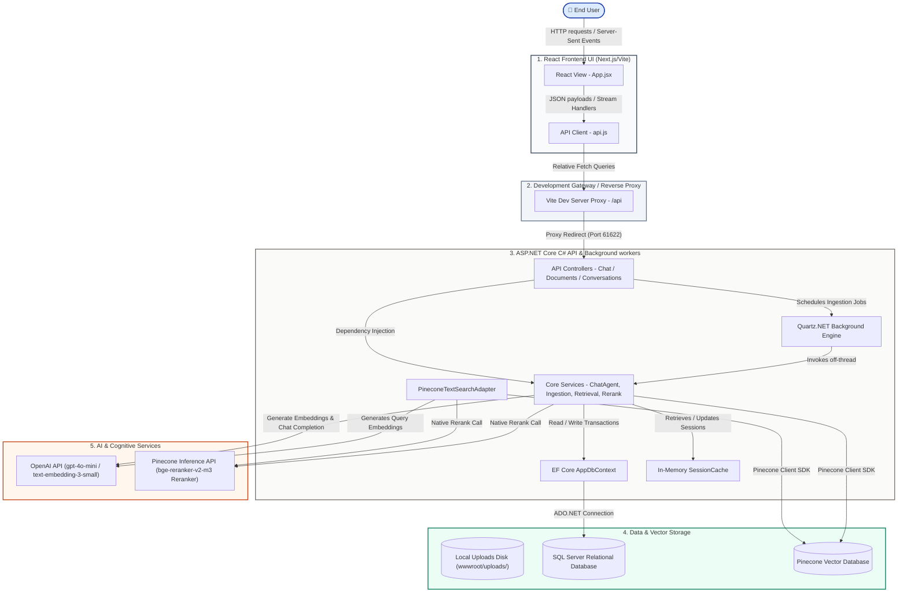
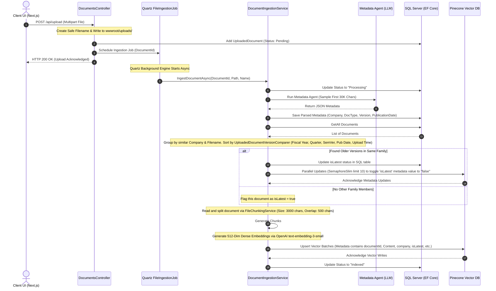
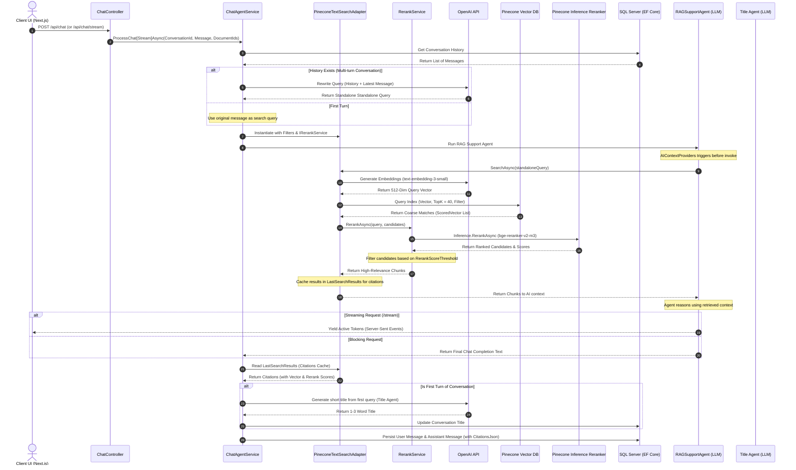

# MSAgentFrameworkRAG — Enterprise-Grade Multi-Agentic RAG Platform

An advanced, production-ready Retrieval-Augmented Generation (RAG) platform engineered to process, version, index, and reason over complex banking, insurance, and compliance documents. Built upon a decoupled full-stack architecture using a **Next.js/React SPA** on the frontend, a **C# ASP.NET Core** backend with **Microsoft Agents AI (AIAgent)**, **OpenAI (GPT-4o-mini & Text-Embedding-3-Small)**, and a **Pinecone Vector Database**, this platform supports multi-document query processing, automated metadata extraction, and precise document versioning.

---

## 📖 Table of Contents
1. [Executive System Architecture (HLSA)](#1-executive-system-architecture-hlsa)
   - [1.1 Architectural Highlights & Decoupled Design](#11-architectural-highlights--decoupled-design)
   - [1.2 High-Fidelity Architecture Blueprint](#12-high-fidelity-architecture-blueprint)
   - [1.3 Deep-Dive Layer Breakdown](#13-deep-dive-layer-breakdown)
2. [🤖 Agentic Orchestration Framework (LLD)](#2-agentic-orchestration-framework-lld)
   - [2.1 Low-Level Service Contract Class Diagram](#21-low-level-service-contract-class-diagram)
   - [2.2 Micro-Agent Functional Specifications](#22-micro-agent-functional-specifications)
3. [🔄 Dynamic System Flow Pipelines](#3-dynamic-system-flow-pipelines)
   - [A. Asynchronous Ingestion & Document Freshness Pipeline](#a-asynchronous-ingestion--document-freshness-pipeline)
   - [B. Conversational RAG Chat & Retrieval Loop](#b-conversational-rag-chat--retrieval-loop)
4. [🗄️ Database, Schema & Vector Design](#4-database-schema--vector-design)
   - [4.1 Relational Schema Map (SQL Server via EF Core)](#41-relational-schema-map-sql-server-via-ef-core)
   - [4.2 Vector Schema (Pinecone Index Metadata)](#42-vector-schema-pinecone-index-metadata)
5. [🚀 Getting Started & Setup](#5-getting-started--setup)
6. [🔬 Advanced RAG Engineering & Layout Optimization](#6-advanced-rag-engineering--layout-optimization)


---

## 1. Executive System Architecture (HLSA)

### 1.1 Architectural Highlights & Decoupled Design
To prepare the RAG platform for massive, highly scalable multi-agent environments, the system was fully refactored from a monolithic approach into a highly decoupled **Controller-Service-Repository** pattern. All core features are wrapped in dependency-injected (DI) services:
* **`IDocumentIngestionService`**: Handles ingestion tasks, file chunking, embeds text, and writes indices to Pinecone.
* **`IRetrievalService`**: Decouples the Pinecone vector similarity querying from the controllers and agents, generating balanced citation objects.
* **`IRerankService`**: Integrates with the native Pinecone Inference API to perform a second-stage fine search, ranking coarse search results and filtering out low-relevance chunks using a strict configurable threshold.
* **`IChatAgentService`**: Orchestrates stateful multi-turn dialogs, coordinates semantic query rewriting, and runs the AI Agents.
* **`IDocumentService` / `IConversationService`**: Handle standard relational queries for documents and chat logs in SQL Server.
* **`SessionCache`**: In-memory singleton caching preserving Microsoft Agents AI state.

---

### 1.2 High-Fidelity Architecture Blueprint
This diagram details the interaction between the five system layers, their boundaries, and the data flow through ingestion, coarse querying, and fine-grained reranking:



---

### 1.3 Deep-Dive Layer Breakdown

#### Layer 1: Client Application (React SPA)
* **Stack:** React 18, Next.js / Vite, Lucide Icons, and Vanilla CSS with premium glassmorphic styling (frosty translucent backdrops, glowing status badges, and localized scrolls).
* **`App.jsx`**: Manages state hooks (`conversations`, `documents`, `messages`, `chatDocFilter`, `activeConversationId`, `isSending`) and schedules polling intervals to monitor upload progress.
* **`api.js`**: Low-level integration module. Packs file selections into `FormData` envelopes for multipart endpoint consumption and includes the case-insensitive helper `getProp(obj, key)` to guarantee total resilience against backend JSON serialization casing mismatches.

#### Layer 2: Development Gateway / Proxy
* **Technology:** Vite dev server reverse proxy configurations.
* **Responsibility:** Intercepts relative client calls `/api` and forwards them to C# API endpoint `http://localhost:61622`. This solves CORS issues and prevents JSON deserializer failures caused when relative paths fallback incorrectly to static HTML pages.

#### Layer 3: C# Web API Core (ASP.NET Core API)
* **Stack:** .NET 8.0/10.0, Microsoft Agents AI framework, Quartz.NET Scheduler, Pinecone .NET SDK.
* **`Program.cs`**: Declares CORS policy, DI service registrations, Quartz jobs, and database setup, recovering from stuck states (e.g. marking "Processing" files as "Failed" on system restarts).
* **Modular Clean Directory Segregation:** To maintain enterprise code standards, the backend has been structured into clean, segregated, functional subdirectories:
  * `Data/` ── Relational DB Context (`AppDbContext.cs`).
  * `Models/` ── Logical domain schemas (`Models.cs`) and search chunk models (`TextChunk.cs`).
  * `Settings/` ── Options pattern configurations (`Settings.cs`).
  * `Jobs/` ── Background scheduler workers (`FileIngestionJob.cs`).
  * `Caching/` ── Stateful memory cache adapters (`SessionCache.cs`).
  * `Search/` ── Dense vector embedding generation (`Embeddings.cs`) and search adapters (`SearchAdapter.cs`).
  * `Helpers/` ── Multi-format layout parser engines (`FileReader.cs`).
* **Two-Stage Retrieval (Vector Search + Native Pinecone Reranking)**: To maximize retrieval accuracy, the backend implements a state-of-the-art two-stage retrieval pipeline. When a query is initiated:
  1. **Stage 1 (Coarse Search):** The rewritten search query is vectorized via OpenAI's `text-embedding-3-small` and used to query Pinecone for a broad set of candidate chunks (configured by `QueryTopK`, e.g., 40 matches).
  2. **Stage 2 (Fine Reranking):** The candidate chunks are sent to the native `IRerankService`, which invokes the Pinecone Inference API with the `bge-reranker-v2-m3` model. Chunks are scored and filtered using a high-precision relevance threshold (`RerankScoreThreshold`, e.g., 0.5) to keep only the top `RerankTopN` most relevant segments, mitigating LLM context clutter and avoiding hallucinations.

#### Layer 4: Storage Layer
* **Local Disk (`wwwroot/uploads/`)**: Caches uploaded documents safely for background processing and file chunking.
* **SQL Server**: Keeps conversational logs, citations, and document metadata.
* **Pinecone DB**: Holds vectorized chunks with dense metadata fields for semantic lookup.

#### Layer 5: Cognitive & Inference Services
* **OpenAI Embeddings (`text-embedding-3-small`)**: Generates 512-dimension vectors representing text blocks.
* **OpenAI Completions (`gpt-4o-mini`)**: Powers the reasoning engine, grounding conversations in context retrieved from Pinecone.
* **Pinecone Inference (`bge-reranker-v2-m3`)**: Evaluates cross-attention semantic relevance between the query and retrieved context chunks, providing precise fine-grained ranking scores.

---

## 2. 🤖 Agentic Orchestration Framework (LLD)

### 2.1 Low-Level Service Contract Class Diagram
The Low-Level Design defines strict contract boundaries to allow clean service decoupling, two-stage retrieval integration, and mock-friendly unit testing:

```mermaid
classDiagram
    class IDocumentService {
        <<interface>>
        +AddOrUpdate(UploadedDocument doc) Void
        +Get(string id) UploadedDocument
        +GetAll() List~UploadedDocument~
    }
    
    class IConversationService {
        <<interface>>
        +GetAll() List~Conversation~
        +Get(string id) Conversation
        +Create(string? name) Conversation
        +AddMessage(string conversationId, ChatMessageInfo msg) Void
        +Delete(string id) bool
        +Rename(string id, string name) bool
        +GetOrCreateSessionAsync(string conversationId, AIAgent agent) Task~AgentSession~
    }

    class IDocumentIngestionService {
        <<interface>>
        +IngestDocumentAsync(string documentId, string filePath, string fileName) Task
    }

    class IRetrievalService {
        <<interface>>
        +RetrieveContextAsync(string query, string? documentId) Task~List~SourceCitation~~
        +RetrieveContextAsync(string query, List~string~? documentIds) Task~List~SourceCitation~~
    }

    class IRerankService {
        <<interface>>
        +RerankAsync(string query, List~SourceCitation~~ candidates, CancellationToken cancellationToken) Task~List~SourceCitation~~~
    }

    class IChatAgentService {
        <<interface>>
        +ProcessChatAsync(ChatRequest request) Task~ChatResponse~
        +ProcessChatStreamAsync(ChatRequest request) IAsyncEnumerable~string~
    }

    class IMetadataExtractionService {
        <<interface>>
        +ExtractMetadataAsync(string filePath, string fileName) Task~AgentResponse~DocumentMetadataResult~~
    }

    class DocumentService {
        -AppDbContext _dbContext
        +AddOrUpdate(UploadedDocument doc) Void
    }
    
    class ConversationService {
        -AppDbContext _dbContext
        -SessionCache _sessionCache
        +GetOrCreateSessionAsync(string conversationId, AIAgent agent) Task~AgentSession~
    }

    class DocumentIngestionService {
        -IDocumentService _documentService
        -IMetadataExtractionService _metadataService
        -FileChunkingService _chunkingService
        +IngestDocumentAsync(...) Task
    }

    class RetrievalService {
        -OpenAISettings _openAiSettings
        -PineconeSettings _pineconeSettings
        -IRerankService _rerankService
        +RetrieveContextAsync(...) Task~List~SourceCitation~~
    }

    class RerankService {
        -PineconeSettings _pineconeSettings
        -ILogger~RerankService~ _logger
        +RerankAsync(...) Task~List~SourceCitation~~~
    }

    class ChatAgentService {
        -IConversationService _conversationService
        -IRetrievalService _retrievalService
        -IRerankService _rerankService
        +ProcessChatAsync(...) Task~ChatResponse~
    }

    class SessionCache {
        -ConcurrentDictionary~string, AgentSession~ _sessions
        +Get(string conversationId) AgentSession
        +Set(string conversationId, AgentSession session) Void
    }

    class PineconeTextSearchAdapter {
        -PineconeClient _pinecone
        -IRerankService _rerankService
        +SearchAsync(string query, CancellationToken ct) Task~IEnumerable~TextSearchResult~~
    }

    DocumentService ..|> IDocumentService
    ConversationService ..|> IConversationService
    DocumentIngestionService ..|> IDocumentIngestionService
    RetrievalService ..|> IRetrievalService
    RerankService ..|> IRerankService
    ChatAgentService ..|> IChatAgentService
    MetadataExtractionService ..|> IMetadataExtractionService

    ChatAgentService --> IConversationService
    ChatAgentService --> IRetrievalService
    ChatAgentService --> IRerankService
    ConversationService --> SessionCache
    DocumentIngestionService --> IDocumentService
    DocumentIngestionService --> IMetadataExtractionService
    RetrievalService --> IRerankService
    PineconeTextSearchAdapter --> IRerankService
    ChatAgentService ..> PineconeTextSearchAdapter : instantiates
```



---

### 2.2 Micro-Agent Functional Specifications

The system utilizes four distinct **Microsoft Agents AI** (`AIAgent`) instances, coordinating to process data, rewrite queries, and deliver highly cited responses:

#### 1. Metadata Extraction Agent
* **Class:** `MetadataExtractionService` ([MetadataExtractionService.cs](file:///d:/MSAgentFrameworkRAG/MSAgentFrameworkRAG/MSAgentFrameworkRAG/Services/MetadataExtractionService.cs))
* **Underlying Model:** `gpt-4o-mini`
* **Agent Creation:** Initialized using `client.AsAIAgent()` with custom `ChatClientAgentOptions` mapping instructions.
* **Execution Boundary:** Invoked synchronously inside Quartz's background worker on the first **30,000 characters** extracted from documents (PDF, Docx, or txt).
* **System Persona & Rules:** Strict JSON parsing engine. Instructed to normalize and standardize company names, document types, publication dates, and versions. Synonyms like *"MITC"*, *"Cardmember Agreement"*, or *"Most Important Terms & Conditions"* are dynamically mapped to `Credit Card Terms And Conditions`. Outputs a standardized normalized name: `<CompanyName>_<DocumentType>`.
* **Output Contract:**
  ```json
  {
    "company": "State Bank Of India (SBI)",
    "documentType": "Credit Card Charges And Fees",
    "version": "2.5",
    "fileName": "State_Bank_Of_India_SBI_Credit_Card_Charges_And_Fees",
    "fiscalQuarter": "N/A",
    "fiscalYear": 0,
    "publicationDate": "2025-06"
  }
  ```

#### 2. Query Rewrite Agent
* **Method:** `ChatAgentService.RewriteQueryAsync` ([ChatAgentService.cs#L261](file:///d:/MSAgentFrameworkRAG/MSAgentFrameworkRAG/MSAgentFrameworkRAG/Services/ChatAgentService.cs#L261))
* **Underlying Model:** `gpt-4o-mini`
* **Agent Creation:** Instantiated dynamically using the `client.AsAIAgent()` wrapper.
* **Execution Boundary:** Triggered on incoming messages *if and only if* prior dialogue history exists in the SQL database. Takes the last **5 historical messages** and the latest user query.
* **System Persona & Rules:** Resolves relative references, pronouns, and ellipses (e.g. resolving *"Compare it with SBI SimplyClick"* following a discussion on *"HDFC Tata Neu"* to *"Comparison of HDFC Tata Neu and SBI SimplyClick credit cards annual fees and benefits"*). Generates a **single standalone query string** optimized for vector search without explaining itself or returning conversational filler.

#### 3. Session Title Agent
* **Method:** `ChatAgentService.GenerateChatTitleAsync` ([ChatAgentService.cs#L623](file:///d:/MSAgentFrameworkRAG/MSAgentFrameworkRAG/MSAgentFrameworkRAG/Services/ChatAgentService.cs#L623))
* **Underlying Model:** `gpt-4o-mini`
* **Execution Boundary:** Triggered asynchronously on the first turn of a conversation.
* **System Persona & Rules:** Analyzes the user's initial question and generates a clean summary sidebar header. Constraint: **Exactly 1 to 3 words** without quotes, punctuation, or markdown.

#### 4. RAG Support Chat Agent (RAGSupportAgent)
* **Class:** `ChatAgentService` ([ChatAgentService.cs#L16](file:///d:/MSAgentFrameworkRAG/MSAgentFrameworkRAG/MSAgentFrameworkRAG/Services/ChatAgentService.cs#L16))
* **Underlying Model:** `gpt-4o-mini`
* **Knowledge Retrieval hook:** Integrates `TextSearchProvider` from `Microsoft.Agents.AI` containing the `PineconeTextSearchAdapter`. Performs vector search *before* invoking the LLM core.
* **System Persona & Rules:** Factual banking and insurance assistant. Strictly answers using only retrieved text chunks. If facts are absent, it replies: *"The requested information is not available in the provided documents."* Multi-document aware: groups information by provider, constructs clear markdown comparison tables, preserves exact numbers, and appends citations in the format `[Source: <DocumentName>]`.

---

## 3. 🔄 Dynamic System Flow Pipelines

### A. Asynchronous Ingestion & Document Freshness Pipeline
Extracts semantic metadata, performs fuzzy family matching, ranks version history to toggle `isLatest` status, and uploads vectors into Pinecone.



* **Dynamic DB Schema Altering:** EF Core's `dbContext.Database.EnsureCreated()` does not alter existing database schemas if tables already exist. On startup, a raw ADO.NET query checks the catalog and appends the new columns to the `UploadedDocuments` table if missing, maintaining backward compatibility.
* **Deterministic Vector updates:** When a version shift occurs, the system utilizes the `ChunkCount` column to build deterministic vector IDs as `$"{documentId}_chunk_{chunkIndex}"` and triggers parallel metadata updates in Pinecone (throttled by `SemaphoreSlim` to prevent network choking).

---

### B. Conversational RAG Chat & Retrieval Loop
Converts conversational text to vector-optimized queries, performs multi-file search with `$in` vector filters, executes the Two-Stage Retrieval pipeline (vector similarity querying + cross-attention reranking), runs the RAG completion, and streams responses.



* **Multi-File Search & `$in` Filters:** When the user selects "Search across all files" or picks multiple documents, the frontend transmits an array of document IDs. If multiple IDs are active, the retrieval pipeline builds a Pinecone `$in` array filter:
  ```csharp
  var innerFilter = new Metadata();
  innerFilter["$in"] = new MetadataValue(documentIds.Select(id => new MetadataValue(id)).ToArray());
  filter = new Metadata { ["documentId"] = new MetadataValue(innerFilter) };
  filter["isLatest"] = new MetadataValue("true");
  ```
  If no filters are provided, it falls back to a global search querying only files marked `isLatest = "true"`. If a single ID is selected, it bypasses the `isLatest` check entirely, allowing the user to search through historical archived reports.
* **Diversification Search Adapter:** For multi-file selections, the custom `PineconeTextSearchAdapter` scales up `queryTopK` and runs a round-robin source-diversification algorithm to prevent a single document from dominating context feeds.
* **Two-Stage Precision Citations:** Since the AI context is derived from the custom `PineconeTextSearchAdapter` with integrated `IRerankService`, the agent's precise search outputs are automatically cached inside `LastSearchResults`. These are converted back to a structured citation list, mapping vector scores, reranker confidence metrics, and round-trip calculation durations for total transparency.

---

## 4. 🗄️ Database, Schema & Vector Design

### 4.1 Relational Schema Map (SQL Server via EF Core)
The relational system is declared in [AppDbContext.cs](file:///d:/MSAgentFrameworkRAG/MSAgentFrameworkRAG/MSAgentFrameworkRAG/AppDbContext.cs):

```
┌────────────────────────────────────────────────────────┐
│                   UploadedDocuments                    │
├────────────────────────────────────────────────────────┤
│ Id : NVARCHAR(450) [PK]                                │
│ FileName : NVARCHAR(MAX)                               │
│ Status : NVARCHAR(MAX) (Pending/Processing/Indexed)    │
│ ErrorMessage : NVARCHAR(MAX) [Nullable]                │
│ UploadedAt : DATETIME2                                 │
│ DocumentType : NVARCHAR(MAX) [Nullable]                │
│ Company : NVARCHAR(MAX) [Nullable]                     │
│ FiscalQuarter : NVARCHAR(MAX) [Nullable]               │
│ FiscalYear : INT [Nullable]                            │
│ PublicationDate : NVARCHAR(MAX) [Nullable]             │
│ Version : NVARCHAR(MAX) [Nullable]                     │
│ IsLatest : BIT                                         │
│ ChunkCount : INT                                       │
└────────────────────────────────────────────────────────┘

┌──────────────────────────────────────┐     ┌──────────────────────────────────────┐
│           DbConversations            │     │           DbChatMessages             │
├──────────────────────────────────────┤     ├──────────────────────────────────────┤
│ Id : NVARCHAR(450) [PK]              │◄────┤ Id : INT [PK, IDENTITY]              │
│ Name : NVARCHAR(MAX)                 │     │ ConversationId : NVARCHAR(450) [FK]   │
│ CreatedAt : DATETIME2                │     │ Sender : NVARCHAR(MAX) (user/assistant)│
└──────────────────────────────────────┘     │ Text : NVARCHAR(MAX)                 │
                                             │ Timestamp : DATETIME2                │
                                             │ CitationsJson : NVARCHAR(MAX) [Null] │
                                             └──────────────────────────────────────┘
```
* **Citations Persistence & Diagnostic Metadata:** Nested citation structures (`List<SourceCitation>`) are serialized as a string and stored inside `CitationsJson` to avoid table join overhead on fast UI loads. Each citation includes:
  - `SourceName`: The display name of the document and specific page/chunk reference.
  - `SourceLink`: Local server link to the original file for download/preview.
  - `Text`: The exact text context chunk supplied to the LLM.
  - `Score`: The Stage 1 cosine similarity vector score (relative alignment in dense vector space).
  - `RerankScore`: The Stage 2 cross-attention score (range 0 to 1, indicating literal semantic answering suitability).
  - `QueryTimeMs`: The processing latency in milliseconds.
* **Cascading Deletes:** Deleting a `DbConversation` cascades and deletes all related `DbChatMessage` records dynamically.

---

### 4.2 Vector Schema (Pinecone Index Metadata)
Vectors are generated using OpenAI `text-embedding-3-small` with 512 dimensions. The metadata structure includes:

| Field | Type | Purpose |
|---|---|---|
| `documentId` | `String` | Guid linking the vector back to the SQL database. |
| `chunkIndex` | `String` | Local sequence number of the text chunk. |
| `pageNumber` | `String` | The physical page the chunk belongs to (parsed from PDF). |
| `Content` | `String` | Raw text segment representing this chunk. |
| `sourceName` | `String` | The standardized document name for frontend display. |
| `sourceLink` | `String` | Local path of the stored file. |
| `company` | `String` | Normalized organization name (extracted by agent). |
| `documentType`| `String` | Standardized category of the document (extracted by agent). |
| `version` | `String` | Extracted revision version (e.g. `2.5`). |
| `isLatest` | `String` | String flag (`"true"` / `"false"`) to govern freshness filters. |

---

## 5. 🚀 Getting Started & Setup

### 5.1 Environment Configuration
Add connection details and two-stage retrieval settings in your [appsettings.json](file:///d:/MSAgentFrameworkRAG/MSAgentFrameworkRAG/MSAgentFrameworkRAG/appsettings.json):
```json
{
  "Logging": {
    "LogLevel": {
      "Default": "Information",
      "Microsoft.AspNetCore": "Warning"
    }
  },
  "AllowedHosts": "*",
  "ConnectionStrings": {
    "DefaultConnection": "Server=localhost\\SQLEXPRESS;Database=RAGAgent;Integrated Security=True;TrustServerCertificate=True;"
  },
  "OpenAI": {
    "ApiKey": "YOUR_OPENAI_API_KEY",
    "ChatModel": "gpt-4o-mini",
    "EmbeddingModel": "text-embedding-3-small"
  },
  "Pinecone": {
    "ApiKey": "YOUR_PINECONE_API_KEY",
    "IndexName": "YOUR_PINECONE_INDEX_NAME",
    "RerankModel": "bge-reranker-v2-m3",
    "RerankScoreThreshold": 0.5,
    "RerankTopN": 10,
    "QueryTopK": 40
  }
}
```

### 5.2 Execution Steps
1. **Initialize SQL Database & Start Backend:**
   ```bash
   cd MSAgentFrameworkRAG/MSAgentFrameworkRAG
   dotnet restore
   dotnet run
   ```
2. **Start Next.js Frontend:**
   ```bash
   cd next-frontend
   npm install
   npm run dev
   ```
   Open `http://localhost:3000` to interact with the application.

---

## 6. 🔬 Advanced RAG Engineering & Layout Optimization

To achieve 100% factual accuracy on complex, structured financial sheets and insurance documents, the platform incorporates three cutting-edge RAG engineering patterns:

### 6.1 Two-Stage Retrieval & Pinecone Reranking
Vector search alone (`text-embedding-3-small` cosine similarity) often ranks context based on keyword overlap, bringing in irrelevant noise. We implement a **Two-Stage Precision Pipeline**:
1. **Stage 1 (Coarse Retrieval):** Vector search fetches a broad pool of candidates (`QueryTopK = 40`) from Pinecone.
2. **Stage 2 (Fine Reranking):** Candidates are sent to the native Pinecone Inference API powered by the **`bge-reranker-v2-m3`** cross-attention model. It scores candidates against the user query, and filters out low-relevance noise via a calibrated threshold (`RerankScoreThreshold = 0.25`), serving only the top `RerankTopN = 10` high-fidelity chunks to the LLM.

### 6.2 Parent-Child (Hierarchical) Retrieval Architecture
To solve **Semantic Vector Dilution** (where large tables or chapters have "averaged out" vector meanings that fail specific queries), we decouple search from reading:
* **The Parents (SQL Database):** The entire structured Markdown/JSON table or document section is stored as a `DbParentChunk` in SQL Server.
* **The Children (Pinecone):** Small 5-row blocks with column headers prepended are vectorized in Pinecone, containing a `parentId` pointing back to SQL.
* **The Context Swap:** When a child chunk matches in Pinecone, the `SearchAdapter` fetches the **full Parent Table** from SQL and swaps the context. The LLM receives complete, structurally aligned grids instead of fragmented sentences.

```
                  ┌──────────────────────────────────────────────┐
                  │   Parent Chunk: Whole Table (Markdown/JSON)  │ (Stored in SQL DB)
                  └──────────────────────┬───────────────────────┘
                                         │
                 ┌───────────────────────┼───────────────────────┐
                 ▼                       ▼                       ▼
     ┌───────────────────────┐ ┌───────────────────────┐ ┌───────────────────────┐
     │ Child: Row 1 + Header │ │ Child: Row 2 + Header │ │ Child: Row 3 + Header │ (Vectorized in Pinecone)
     └───────────────────────┘ └───────────────────────┘ └───────────────────────┘
```

### 6.3 Row-Span Table Propagation (Forward-Filling)
In banking PDF charges sheets, card names often vertically span across multiple rows of fees. Standard line-by-line extractors leave subsequent fee rows "orphaned" without their entity name. 
* **The Solution:** Our `PdfLayoutAnalysisService` implements **Row-Span Propagation**. It tracks visual column horizontal alignments (X-coordinates). If a line starts with a horizontal shift (indicating an empty spanned Column 0), it automatically forward-fills and prepends the active `CardName` from the cache, ensuring every single text chunk remains fully self-contained.

### 6.4 Generic Multi-Format Document Extraction Framework
The ingestion pipeline is completely format-agnostic. Using a **Factory Pattern** coupled with a **Unified Data Contract (`StructuredDocument`)**, the platform reads and standardizes **PDF, Word (`.docx`), Excel (`.xlsx`), and PowerPoint (`.pptx`)** files:
* **`StructuredDocument`** maps heading streams to `TextSection` and data spreadsheets/tables to `TableSection` (utilizing standard markdown tables).
* A single, unified parent-child slicing engine processes the contract identically for all formats, guaranteeing that any layout or table-parsing upgrades instantly work across all enterprise file types.

---