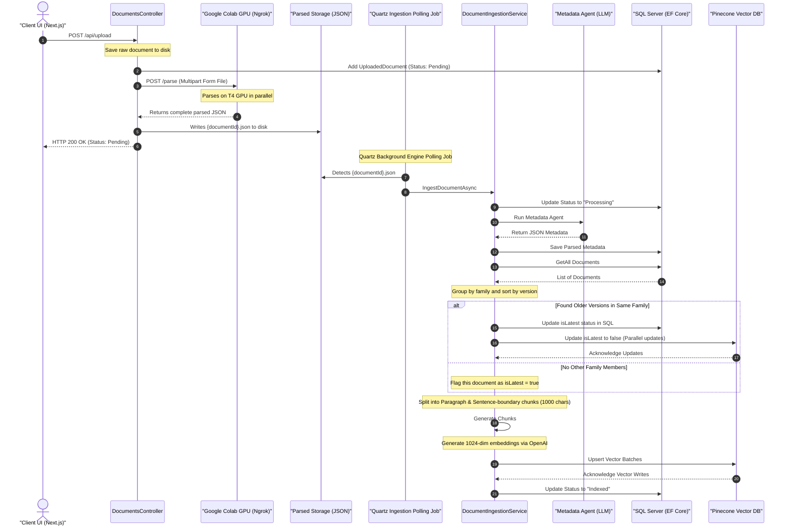
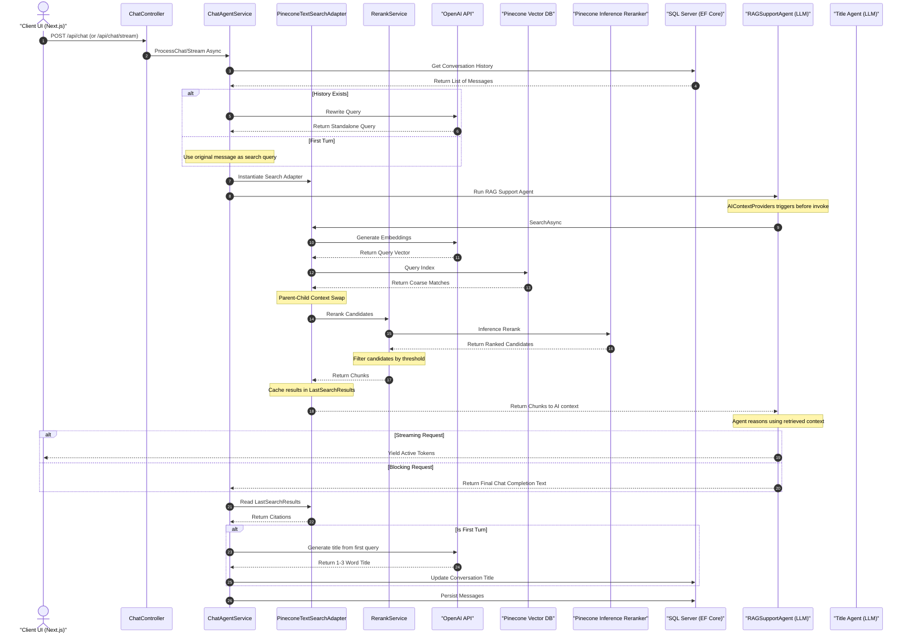

# MSAgentFrameworkRAG — Enterprise-Grade Contract Analysis RAG Platform

An advanced, production-ready Retrieval-Augmented Generation (RAG) platform engineered to process, version, index, and analyze complex legal, compliance, and vendor contracts. Built upon a decoupled full-stack architecture using a **Next.js/React SPA** on the frontend, a **C# ASP.NET Core** backend with **Microsoft Agents AI (AIAgent)**, **OpenAI (gpt-4o-mini & text-embedding-3-small)**, and a **Pinecone Vector Database**, this platform supports multi-document legal query processing, state-of-the-art Two-Stage Retrieval (dense vector similarity search + Pinecone cross-attention reranking), automated metadata extraction, and precise contract versioning and amendment control.

---

## 📖 Table of Contents
1. [Executive System Architecture (HLSA)](#1-executive-system-architecture-hlsa)
   - [1.1 Architectural Highlights & Decoupled Design](#11-architectural-highlights--decoupled-design)
   - [1.2 High-Fidelity Architecture Blueprint](#12-high-fidelity-architecture-blueprint)
   - [1.3 Deep-Dive Layer Breakdown](#13-deep-dive-layer-breakdown)
2. [🤖 Agentic Orchestration Framework (LLD)](#2-agentic-orchestration-framework-lld)
   - [2.1 Low-Level Service Contract Class Diagram](#21-low-level-service-contract-class-diagram)
   - [2.2 Detailed AI Agent Specifications](#22-detailed-ai-agent-specifications)
3. [🔄 Dynamic System Flow Pipelines](#3-dynamic-system-flow-pipelines)
   - [A. Asynchronous Contract Ingestion & version control Pipeline](#a-asynchronous-contract-ingestion--version-control-pipeline)
   - [B. Conversational RAG Chat & Retrieval Loop](#b-conversational-rag-chat--retrieval-loop)
4. [🗄️ Database, Schema & Vector Design](#4-database-schema--vector-design)
   - [4.1 Relational Schema Map (SQL Server via EF Core)](#41-relational-schema-map-sql-server-via-ef-core)
   - [4.2 Vector Schema (Pinecone Index Metadata)](#42-vector-schema-pinecone-index-metadata)
5. [🚀 Getting Started & Setup](#5-getting-started--setup)
   - [5.3 Distributed Docling Parsing Service Setup](#53-distributed-docling-parsing-service-setup)
6. [🔬 Advanced RAG Engineering & Contract Optimization](#6-advanced-rag-engineering--contract-optimization)

---

## 1. Executive System Architecture (HLSA)

### 1.1 Architectural Highlights & Decoupled Design
To prepare the RAG platform for massive, highly scalable multi-agent environments, the system is structured using a highly decoupled **Controller-Service-Repository** pattern. All core features are wrapped in dependency-injected (DI) services:
* **`IDocumentIngestionService`**: Handles contract ingestion tasks, processes file text chunking, embeds text blocks, and writes indices to Pinecone.
* **`IRetrievalService`**: Decouples the Pinecone vector similarity querying from the controllers and agents, generating balanced citation objects.
* **`IRerankService`**: Integrates with the native Pinecone Inference API to perform a second-stage fine search, ranking coarse search results using cross-attention and filtering out low-relevance chunks via a configurable threshold.
* **`IChatAgentService`**: Orchestrates stateful multi-turn dialogs, coordinates semantic query rewriting, and runs the Microsoft AI Agents.
* **`IMetadataExtractionService`**: Extracts structured, normalized contract metadata fields from raw uploaded agreement files (PDF or Word) using the dedicated extraction agent.
* **`IDocumentService` / `IConversationService`**: Handle standard relational queries for documents and chat logs in the SQL database.
* **`SessionCache`**: In-memory singleton caching preserving Microsoft Agents AI state across conversations.
* **Distributed Layout-Aware Docling Parser (Google Colab GPU)**: Offloads PDF and Word parsing to a remote FastAPI Python worker hosted on a Google Colab T4 GPU (exposed via Ngrok). The C# backend uploads files directly via Multipart Form POST, receiving the complete parsed JSON response synchronously. This design eliminates CPU memory exhaustion (`std::bad_alloc`) and increases parsing speed by over **80x** (converting a 41-page PDF in 36 seconds).

---

## 1.2 High-Fidelity Architecture Blueprint
This diagram details the interaction between the system layers, their boundaries, the distributed Docling parsing worker, and the data flow through ingestion, coarse querying, and fine-grained reranking:

```mermaid
flowchart TD
    User["End User"]
    
    subgraph ClientLayer ["1. React Frontend UI (Next.js SPA)"]
        UI["React View - page.js"]
        API_Helper["API Client - api.js"]
        Theme_Sync["Theme Synchronizer (Light/Dark)"]
    end
    
    subgraph ProxyLayer ["2. Development Gateway / Reverse Proxy"]
        Proxy["Next.js/Vite Dev Server Proxy - /api"]
    end

    subgraph BackendLayer ["3. ASP.NET Core C# API & Background workers"]
        Controllers["API Controllers - Chat / Documents / Conversations"]
        Services["Core Services - ChatAgent, Ingestion, Retrieval, Rerank, MetadataExtractor"]
        Quartz["Quartz.NET Background Engine (IngestionPollingJob)"]
        DB_Context["EF Core AppDbContext"]
        S_Cache["In-Memory SessionCache"]
        Vector_Adapter["PineconeTextSearchAdapter"]
    end

    subgraph StorageLayer ["4. Shared & Database Storage"]
        Shared_Vol["Shared Storage (wwwroot/storage/)"]
        SQL_DB["SQL Server Relational Database"]
        Pinecone_DB["Pinecone Vector Database"]
    end

    subgraph ParsingLayer ["5. Distributed Parsing Worker"]
        Docling_Worker["Google Colab T4 GPU FastAPI Worker"]
        HuggingFace["Colab GPU HF Model Cache (Layout/Table Models)"]
    end

    subgraph AILayer ["6. AI & Cognitive Services"]
        OpenAI_API["OpenAI API (gpt-4o-mini / text-embedding-3-small)"]
        Pinecone_Inference["Pinecone Inference API (bge-reranker-v2-m3 Reranker)"]
    end

    User -->|"HTTP requests / Server-Sent Events"| UI
    UI -->|"JSON payloads / Stream Handlers"| API_Helper
    UI -->|"Saves Theme in Local Storage"| Theme_Sync
    API_Helper -->|"Relative Fetch Queries"| Proxy
    Proxy -->|"Proxy Redirect (Port 61622)"| Controllers
    
    Controllers -->|"Dependency Injection"| Services
    Controllers -->|"Uploads document (Multipart Form POST /parse)"| Docling_Worker
    Controllers -->|"Schedules polling via Quartz"| Quartz
    
    Docling_Worker -->|"Reads layout weights"| HuggingFace
    Docling_Worker -->>|"Returns parsed JSON synchronously"| Controllers
    
    Controllers -->|"Writes parsed JSON to disk ({id}.json)"| Shared_Vol
    
    Quartz -->|"Checks parsed JSON in"| Shared_Vol
    Quartz -->|"Triggers downstream ingestion"| Services
    
    Services -->|"Read / Write Transactions"| DB_Context
    Services -->|"Retrieves / Updates Sessions"| S_Cache
    DB_Context -->|"SQL Connection (EF Core)"| SQL_DB
    
    Services -->|"Generate Embeddings & Chat Completion"| OpenAI_API
    Vector_Adapter -->|"Pinecone Client SDK"| Pinecone_DB
    Services -->|"Pinecone Client SDK"| Pinecone_DB
    Vector_Adapter -->|"Generates Query Embeddings"| OpenAI_API
    Vector_Adapter -->|"Native Rerank Call"| Pinecone_Inference
    Services -->|"Native Rerank Call"| Pinecone_Inference
```

---

### 1.3 Deep-Dive Layer Breakdown

#### Layer 1: Client Application (Next.js React SPA)
* **Stack:** React 18, Next.js, Lucide Icons, and Vanilla CSS with premium glassmorphic styling (frosty translucent backdrops, glowing status badges, and synchronized Light/Dark themes).
* **`page.js`**: Manages state hooks (`conversations`, `documents`, `messages`, `chatDocFilter`, `activeConversationId`, `isDarkMode`) and schedules polling intervals to monitor upload progress.
* **Light & Dark Theme System**: Built with modern CSS custom variables. Synergizes with user preferences and caches state dynamically in `localStorage` ('theme' key).
* **`api.js`**: Low-level integration module. Packs file selections into `FormData` envelopes for multipart endpoint consumption and includes the case-insensitive helper `getProp(obj, key)` to guarantee total resilience against backend JSON serialization casing mismatches.

#### Layer 2: Development Gateway / Proxy
* **Technology:** Next.js dev server configurations.
* **Responsibility:** Intercepts relative client calls `/api` and forwards them to the C# API endpoint `http://localhost:61622`. This solves CORS issues and prevents JSON deserializer failures caused when relative paths fallback incorrectly to static HTML pages.

#### Layer 3: C# Web API Core (ASP.NET Core API)
* **Stack:** .NET 8.0/10.0, Microsoft Agents AI framework, Quartz.NET Scheduler, Pinecone .NET SDK.
* **`Program.cs`**: Declares CORS policy, DI service registrations, Quartz jobs, and database setup, recovering from stuck states (e.g. marking "Processing" files as "Failed" on system restarts).
* **Modular Clean Directory Segregation:**
  * `Data/` ── Relational DB Context (`AppDbContext.cs`).
  * `Models/` ── Logical domain schemas (`Models.cs`) and search chunk models (`TextChunk.cs`).
  * `Settings/` ── Options pattern configurations (`Settings.cs`).
  * `Jobs/` ── Background scheduler polling workers (`IngestionPollingJob.cs`).
  * `Caching/` ── Stateful memory cache adapters (`SessionCache.cs`).
  * `Search/` ── Custom parallel hybrid search (`LocalBm25Retriever.cs`, `SearchAdapter.cs`) and dense vector embedding generators (`Embeddings.cs`).
  * `Helpers/` ── Docling parsing wrapper (`DoclingParser.cs`) and DI engine resolver (`ParserFactory.cs`).

* **Two-Stage Parallel Hybrid Retrieval Pipeline**: To maximize recall and precision for exact legal terms and semantic intent, the backend executes a hybrid retrieval strategy:
  1. **Stage 1 (Coarse Retrieval - Parallel Dense & Sparse):** Triggers a dense vector query (OpenAI embedding + Pinecone similarity search) and a local lexical sparse query (C# BM25 over SQL Server `ParentChunks`) concurrently. A deduplicating fusion step unions the candidate pools using exact text comparisons.
  2. **Stage 2 (Fine Reranking):** Combined candidates are sent to the native `IRerankService` invoking the Pinecone Inference API (`bge-reranker-v2-m3` cross-attention model). Chunks are scored and filtered using a configurable relevance threshold (`RerankScoreThreshold = 0.50`), ensuring only high-fidelity chunks enter the LLM context.

---

## 2. 🤖 Agentic Orchestration Framework (LLD)

### 2.1 Low-Level Service Contract Class Diagram
The Low-Level Design defines strict contract boundaries to allow clean service decoupling, two-stage hybrid retrieval integration, and mock-friendly unit testing:

```mermaid
classDiagram
    class IDocumentService {
        <<interface>>
        +AddOrUpdate()
        +Get() UploadedDocument
        +GetAll() List~UploadedDocument~
    }
    
    class IConversationService {
        <<interface>>
        +GetAll() List~Conversation~
        +Get() Conversation
        +Create() Conversation
        +AddMessage()
        +Delete() bool
        +Rename() bool
        +GetOrCreateSessionAsync() Task
    }

    class IDocumentIngestionService {
        <<interface>>
        +IngestDocumentAsync() Task
    }

    class IRetrievalService {
        <<interface>>
        +RetrieveContextAsync() List~SourceCitation~
    }

    class IRerankService {
        <<interface>>
        +RerankAsync() List~SourceCitation~
    }

    class IChatAgentService {
        <<interface>>
        +ProcessChatAsync() ChatResponse
        +ProcessChatStreamAsync() IAsyncEnumerable
    }

    class IMetadataExtractionService {
        <<interface>>
        +ExtractMetadataAsync() Task
    }

    class DocumentService {
        -AppDbContext dbContext
        +AddOrUpdate()
    }
    
    class ConversationService {
        -AppDbContext dbContext
        -SessionCache sessionCache
        +GetOrCreateSessionAsync() Task
    }

    class DocumentIngestionService {
        -IDocumentService documentService
        -IMetadataExtractionService metadataService
        -FileChunkingService chunkingService
        +IngestDocumentAsync() Task
    }

    class RetrievalService {
        -OpenAISettings openAiSettings
        -PineconeSettings pineconeSettings
        -IRerankService rerankService
        +RetrieveContextAsync() List~SourceCitation~
    }

    class RerankService {
        -PineconeSettings pineconeSettings
        -ILogger logger
        +RerankAsync() List~SourceCitation~
    }

    class ChatAgentService {
        -IConversationService conversationService
        -IRetrievalService retrievalService
        -IRerankService rerankService
        +ProcessChatAsync() ChatResponse
    }

    class SessionCache {
        -ConcurrentDictionary sessions
        +Get() AgentSession
        +Set()
    }

    class PineconeTextSearchAdapter {
        -PineconeClient pinecone
        -IRerankService rerankService
        -AppDbContext dbContext
        +SearchAsync() IEnumerable
    }

    class LocalBm25Retriever {
        <<static>>
        +RetrieveBm25CandidatesAsync() List~SourceCitation~
    }

    DocumentService ..|> IDocumentService
    ConversationService ..|> IConversationService
    DocumentIngestionService ..|> IDocumentIngestionService
    RetrievalService ..|> IRetrievalService
    RerankService ..|> IRerankService
    ChatAgentService ..|> IChatAgentService
    MetadataExtractionService ..|> IMetadataExtractionService
 
    ChatAgentService --> IConversationService
    ChatAgentService --> IRetrievalService
    ChatAgentService --> IRerankService
    ConversationService --> SessionCache
    DocumentIngestionService --> IDocumentService
    DocumentIngestionService --> IMetadataExtractionService
    RetrievalService --> IRerankService
    PineconeTextSearchAdapter --> IRerankService
    PineconeTextSearchAdapter --> AppDbContext
    PineconeTextSearchAdapter ..> LocalBm25Retriever : invokes
    ChatAgentService ..> PineconeTextSearchAdapter : instantiates
```



---

### 2.2 Detailed AI Agent Specifications

The system utilizes four distinct **Microsoft Agents AI** (`AIAgent`) instances, coordinating to process contract uploads, optimize query paths, title active discussions, and deliver highly cited, jargon-free legal analysis:

| Agent | Class/Method | Trigger Boundary | Underlying Model | Primary System Prompt | Response Format / Output |
| :--- | :--- | :--- | :--- | :--- | :--- |
| **1. Contract Metadata Extraction Agent** | `MetadataExtractionService` | Synchronously runs on the first **5 pages (up to 30,000 characters)** of any uploaded PDF or Word document. | `gpt-4o-mini` | Strict contract parsing guidelines. Normalizes parties, title, canonical agreement type, effective/signing dates, governing law, jurisdiction, status, amendment tracking, versioning, and standardized file names. | Strict serialized JSON object mapping exact database models (e.g. `partyA`, `partyB`, `governingLaw`, `effectiveDate`, `version`). |
| **2. Query Rewrite Agent** | `ChatAgentService.RewriteQueryAsync` | Triggered on incoming chat messages *if and only if* prior dialogue history exists. Analyzes the last **5 historical messages** and the latest user query. | `gpt-4o-mini` | `ContractPrompts.QueryRewriteInstructions`. Instructed to resolve pronouns ("it", "this SLA", "both agreements") and convert follow-up questions into fully qualified standalone search queries. | A **single standalone query string** optimized for dense vector search (e.g., `"Microsoft SLA and AWS SLA termination terms"`). No explanations, markdown, or conversational fluff. |
| **3. Session Title Agent** | `ChatAgentService.GenerateChatTitleAsync` | Triggered asynchronously on the first user query of a conversation thread. | `gpt-4o-mini` | `ContractPrompts.TitleInstructions`. Synthesizes the initial user intent into a concise sidebar title. | A **1 to 3 word title** (e.g., `"Liability Comparison"` or `"NDA Confidentiality"`), free of quotes, punctuation, or markdown. |
| **4. RAG Support Chat Agent** | `ChatAgentService` | Triggered on every user turn inside the conversational panel. Connects with `TextSearchProvider` to query Pinecone vectors + Pinecone Reranking + SQL parent swapping. | `gpt-4o-mini` | `ContractPrompts.RagInstructions`. Strict legal analysis assistant. Grounded exclusively in retrieved context. Mandates plain-English summaries explaining complex legal concepts (indemnification, covenants) to non-legal persons. | Rich structured **Markdown**. Prefers multi-contract comparison tables, concise bullets for single-contract facts, clear citations (`[Source: <Doc> page <N>]`), and layperson translation columns. |

---

### Detailed Agent Flows and Output Examples

#### 1. Contract Metadata Extraction Agent
* **How it is called:** Inside [DocumentIngestionService.cs](file:///d:/MSAgentFrameworkRAG/MSAgentFrameworkRAG/MSAgentFrameworkRAG/Services/DocumentIngestionService.cs), after parsing the file to text, the service calls `_metadataService.ExtractMetadataAsync(filePath, fileName)`.
* **Flow:** The agent reads up to 30,000 characters of the contract's beginning, extracts standard legal parameters, resolves synonyms, canonicalizes agreement types, and outputs a strict JSON block.
* **Input Text Sample:**
  > "SERVICES AGREEMENT. This Services Agreement (the 'Agreement') is entered into as of May 10, 2026 (the 'Effective Date') by and between Acme Corp, a Delaware corporation ('Acme') and Zenith Solutions LLC, a California limited liability company ('Provider'). This agreement supersedes the Vendor Agreement dated January 15, 2024. Governing law shall be the laws of the State of New York. The parties agree to submit dispute resolution to the courts of New York County..."
* **Agent Response JSON:**
  ```json
  {
    "fileName": "Acme_Corp_Zenith_Solutions_LLC_Master_Services_Agreement",
    "partyA": "Acme Corp",
    "partyB": "Zenith Solutions LLC",
    "agreementTitle": "Services Agreement",
    "agreementType": "Master Services Agreement",
    "effectiveDate": "2026-05-10",
    "executionDate": "2026-05-10",
    "expirationDate": "Unknown",
    "governingLaw": "New York",
    "jurisdiction": "New York County",
    "contractStatus": "active",
    "amendmentNumber": "Unknown",
    "supersedesDocument": "Vendor Agreement dated January 15, 2024",
    "version": "1.0"
  }
  ```

#### 2. Query Rewrite Agent
* **How it is called:** Triggered in `ChatAgentService.cs` during blocking (`ProcessChatAsync`) or streaming (`ProcessChatStreamAsync`) chat requests, before running the vector search adapter.
* **Flow:** Takes conversational message history + active user request -> outputs vector-ready keywords.
* **Input Conversation History:**
  - **User:** "Tell me about the Zenith Services Agreement."
  - **Assistant:** "The Services Agreement between Acme Corp and Zenith Solutions is active, effective May 10, 2026, and governed by New York law."
  - **User:** "What about its governing law and jurisdiction?"
* **Agent Standalone Response:**
  ```text
  Acme Corp Zenith Solutions Services Agreement governing law jurisdiction venue dispute resolution
  ```

#### 3. Session Title Agent
* **How it is called:** Executed on the first message turn in `ChatAgentService.cs` to dynamically name the active chat conversation in the navigation sidebar.
* **Flow:** Summarizes first query -> returns exact 1-to-3 words.
* **Input Query:** "Can you compare the liability limits and caps in the Microsoft SLA and AWS SLA?"
* **Agent Standalone Response:**
  ```text
  Liability Cap Comparison
  ```

#### 4. RAG Support Chat Agent
* **How it is called:** Executed during every turn of the chat interface. It has a custom `AIContextProvider` named `TextSearchProvider` which runs the `searchAdapter.SearchAsync()` function first to load Pinecone and SQL chunks into the LLM context.
* **Flow:** Vectorizes rewritten query -> Broad-match retrieves 40 chunks -> Performs parent-child context swap -> Reranks candidates down to Top 10 with score > 0.5 -> LLM processes context -> Streams formatted output.
* **Agent Response Output Example:**

  Based on the retrieved contracts, here is a comparison of the termination clauses:

  | Document | Clause / Topic | Extracted Text | Summary (Plain English Breakdown) | Source |
  | :--- | :--- | :--- | :--- | :--- |
  | **Acme Corp / Zenith Solutions LLC**<br>*Master Services Agreement* | Termination for Convenience | "Either party may terminate this Agreement without cause upon ninety (90) days prior written notice." | **Termination without reason permitted:** Both parties can end the contract at any time for no reason. However, they must give the other party at least **90 days' notice** in writing. | [Source: Acme_Corp_Zenith_Solutions_LLC_Master_Services_Agreement page 4] |
  | **Acme Corp / Zenith Solutions LLC**<br>*First Amendment* | Amendment to Termination | "Section 4.2 of the Agreement is hereby amended to replace 'ninety (90) days' with 'one hundred twenty (120) days'." | **Notice period extended:** This amendment increases the notice required to end the agreement without cause from 90 days to **120 days**. All other terms remain active. | [Source: Acme_Corp_Zenith_Solutions_LLC_Master_Services_Agreement_First_Amendment page 1] |


---

## 3. 🔄 Dynamic System Flow Pipelines

### A. Asynchronous Contract Ingestion & Version Control Pipeline
Extracts semantic contract metadata, performs fuzzy family matching, ranks version history to toggle `isLatest` status, and uploads vectors into Pinecone.



* **Contract Versioning & Family Matching:** The system dynamically links contracts into the same family (`IsSameDocumentFamily()`) if they share symmetric contracting parties (`partyA` and `partyB` matched regardless of order), same canonical `agreementType`, and fuzzy-matching agreement titles.
* **Amendment & Chronological Sorting Comparison:** Version ranking is calculated deterministically via `UploadedDocumentVersionComparer`. It sorts by:
  1. `AmendmentNumber` first (using regex and mapping textual names like "First Amendment" -> 1, "Second Amendment" -> 2).
  2. `EffectiveDate` (chronologically parsing dates).
  3. `ExecutionDate` (signing date).
  4. `Version` (semantic version arrays extracted e.g. "2.0.1" -> `[2, 0, 1]`).
  5. `UploadedAt` timestamp (as a final fallback).
  The latest chronologically sorted contract is marked `IsLatest = true`, and older files are marked `IsLatest = false`. Version updates propagate to Pinecone using parallel `UpdateAsync` calls throttled by a `SemaphoreSlim` limit of 10.

---

### B. Conversational RAG Chat & Retrieval Loop
Converts conversational text to vector-optimized queries, performs multi-file search with `$in` vector filters, executes the Two-Stage Retrieval pipeline (vector similarity querying + cross-attention reranking), runs the RAG completion, and streams responses.



* **Multi-File Search & `$in` Filters:** When the user selects "Search across all files" or picks multiple documents, the frontend transmits an array of document IDs. If multiple IDs are active, the retrieval pipeline builds a Pinecone `$in` array filter:
  ```csharp
  var innerFilter = new Metadata();
  innerFilter["$in"] = new MetadataValue(documentIds.Select(id => new MetadataValue(id)).ToArray());
  filter = new Metadata { ["documentId"] = new MetadataValue(innerFilter) };
  filter["isLatest"] = new MetadataValue("true");
  ```
  If a single document ID is selected, it bypasses the `isLatest` check entirely, allowing the user to search through historical archived agreements.
* **Two-Stage Precision Citations:** Since the AI context is derived from the custom `PineconeTextSearchAdapter` with integrated `IRerankService`, the agent's precise search outputs are automatically cached inside `LastSearchResults`. These are converted back to a structured citation list, mapping vector scores, reranker confidence metrics, and round-trip calculation durations for total transparency.

---

## 4. 🗄️ Database, Schema & Vector Design

### 4.1 Relational Schema Map (SQL Server via EF Core)

> [!NOTE]
> Relational database access is managed **exclusively through Entity Framework Core (EF Core)** using SQL Server (`Microsoft.EntityFrameworkCore.SqlServer`). There is no direct ADO.NET code (such as `SqlCommand`, `SqlDataReader`, etc.) implemented in the codebase. All database reads, writes, and relationships are managed programmatically via the `AppDbContext` context class.

The relational system is declared in [AppDbContext.cs](file:///d:/MSAgentFrameworkRAG/MSAgentFrameworkRAG/MSAgentFrameworkRAG/Data/AppDbContext.cs):

```
┌────────────────────────────────────────────────────────┐
│                   UploadedDocuments                    │
│────────────────────────────────────────────────────────│
│ Id : NVARCHAR(450) [PK]                                ├────────┐
│ FileName : NVARCHAR(MAX)                               │        │
│ Status : NVARCHAR(MAX) (Pending/Processing/Indexed)    │        │
│ ErrorMessage : NVARCHAR(MAX) [Nullable]                │        │
│ UploadedAt : DATETIME2                                 │        │
│ PartyA : NVARCHAR(MAX) [Nullable]                      │        │
│ PartyB : NVARCHAR(MAX) [Nullable]                      │        │
│ AgreementTitle : NVARCHAR(MAX) [Nullable]              │        │
│ AgreementType : NVARCHAR(MAX) [Nullable]               │        │
│ EffectiveDate : NVARCHAR(MAX) [Nullable]               │        │
│ ExecutionDate : NVARCHAR(MAX) [Nullable]               │        │
│ ExpirationDate : NVARCHAR(MAX) [Nullable]              │        │
│ GoverningLaw : NVARCHAR(MAX) [Nullable]                │        │
│ Jurisdiction : NVARCHAR(MAX) [Nullable]                │        │
│ ContractStatus : NVARCHAR(MAX) [Nullable]              │        │
│ AmendmentNumber : NVARCHAR(MAX) [Nullable]             │        │
│ SupersedesDocument : NVARCHAR(MAX) [Nullable]          │        │
│ ContractMetadataJson : NVARCHAR(MAX) [Nullable]        │        │
│ Version : NVARCHAR(MAX) [Nullable]                     │        │
│ IsLatest : BIT                                         │        │
│ ChunkCount : INT                                       │        │
└────────────────────────────────────────────────────────┘        │
                                                                  │ 1:N
                                                                  │
                                                                  ▼
┌──────────────────────────────────────┐     ┌──────────────────────────────────────┐
│           DbConversations            │     │            DbParentChunks            │
├──────────────────────────────────────┤     ├──────────────────────────────────────┤
│ Id : NVARCHAR(450) [PK]              │◄──┐ │ Id : NVARCHAR(450) [PK]              │
│ Name : NVARCHAR(MAX)                 │   │ │ DocumentId : NVARCHAR(450) [FK]      │
│ CreatedAt : DATETIME2                │   │ │ Content : NVARCHAR(MAX)              │
└──────────────────────────────────────┘   │ │ CreatedAt : DATETIME2                │
                                           │ └──────────────────────────────────────┘
                                       1:N │
                                           │
                                           │
                                           │
                                           │
             ┌─────────────────────────────┘
             │
             ▼
┌──────────────────────────────────────┐
│            DbChatMessages            │
├──────────────────────────────────────┤
│ Id : INT [PK, IDENTITY]              │
│ ConversationId : NVARCHAR(450) [FK]   │
│ Sender : NVARCHAR(MAX) (user/assistant)│
│ Text : NVARCHAR(MAX)                 │
│ Timestamp : DATETIME2                │
│ CitationsJson : NVARCHAR(MAX) [Null] │
└──────────────────────────────────────┘
```

* **Citations & Diagnostics:** Nested citation structures (`List<SourceCitation>`) are serialized as a string and stored inside `CitationsJson` to avoid table join overhead on fast UI loads. Each citation includes:
  - `SourceName`: Display name of the document and specific page/chunk reference.
  - `SourceLink`: Local server link to the original file for download/preview.
  - `Text`: Exact text context chunk supplied to the LLM.
  - `Score`: Stage 1 cosine similarity vector score.
  - `RerankScore`: Stage 2 cross-attention score (range 0 to 1, indicating literal semantic answering suitability).
  - `QueryTimeMs`: Processing latency in milliseconds.

---

### 4.2 Vector Schema (Pinecone Index Metadata)
Vectors are generated using OpenAI `text-embedding-3-small` with 512 dimensions. The metadata structure includes:

| Field | Type | Purpose |
|---|---|---|
| `documentId` | `String` | Guid linking the vector back to the SQL database. |
| `chunkIndex` | `String` | Local sequence number of the text chunk. |
| `pageNumber` | `String` | The physical page the chunk belongs to. |
| `Content` | `String` | Raw text segment representing this chunk. |
| `sourceName` | `String` | Normalized document name for frontend display. |
| `sourceLink` | `String` | Local path of the stored file. |
| `parentId` | `String` | Optional ID linking to the original full parent markdown chunk in SQL Server. |
| `partyA` | `String` | Normalized primary contracting party (extracted by agent). |
| `partyB` | `String` | Normalized secondary contracting party (extracted by agent). |
| `agreementTitle`| `String` | Title from the contract heading (extracted by agent). |
| `agreementType` | `String` | Canonicalized agreement category (extracted by agent). |
| `effectiveDate` | `String` | Date the agreement becomes effective (extracted by agent). |
| `executionDate` | `String` | Signing/execution date if stated separately (extracted by agent). |
| `expirationDate`| `String` | Expiry date only when explicitly stated (extracted by agent). |
| `governingLaw` | `String` | Governing law clause value (extracted by agent). |
| `jurisdiction`  | `String` | Forum, courts, or dispute jurisdiction (extracted by agent). |
| `contractStatus`| `String` | Allowed values: 'active', 'expired', 'amended', 'terminated', 'unknown'. |
| `amendmentNumber`| `String`| Amendment sequence value (extracted by agent). |
| `supersedesDocument`| `String`| Referenced prior agreement/document (extracted by agent). |
| `version` | `String` | Extracted revision version (e.g. `2.5`). |
| `isLatest` | `String` | String flag (`"true"` / `"false"`) to govern freshness filters. |

---

## 5. 🚀 Getting Started & Setup

### 5.1 Environment Configuration
Add connection details and two-stage retrieval settings in your [appsettings.json](file:///d:/MSAgentFrameworkRAG/MSAgentFrameworkRAG/MSAgentFrameworkRAG/appsettings.json):
```json
{
  "Logging": {
    "LogLevel": {
      "Default": "Information",
      "Microsoft.AspNetCore": "Warning"
    }
  },
  "AllowedHosts": "*",
  "ConnectionStrings": {
    "DefaultConnection": "Server=localhost\\SQLEXPRESS;Database=RAGAgent;Integrated Security=True;TrustServerCertificate=True;"
  },
  "OpenAI": {
    "ApiKey": "YOUR_OPENAI_API_KEY",
    "ChatModel": "gpt-4o-mini",
    "RagChatModel": "gpt-5-mini",
    "EmbeddingModel": "text-embedding-3-small"
  },
  "Pinecone": {
    "ApiKey": "YOUR_PINECONE_API_KEY",
    "IndexName": "YOUR_PINECONE_INDEX_NAME",
    "RerankModel": "bge-reranker-v2-m3",
    "RerankScoreThreshold": 0.5,
    "RerankTopN": 10,
    "QueryTopK": 40
  }
}
```

### 5.2 Execution Steps
1. **Initialize SQL Database & Start Backend:**
   ```bash
   cd MSAgentFrameworkRAG/MSAgentFrameworkRAG
   dotnet restore
   dotnet run
   ```
2. **Start Next.js Frontend:**
   ```bash
   cd next-frontend
   npm install
   npm run dev
   ```
   Open `http://localhost:3000` to interact with the application.

### 5.3 Distributed Docling Parsing Service Setup (Google Colab GPU)

To eliminate local CPU bottlenecks, RAM limitations, and potential `std::bad_alloc` OOMs, the document layout-aware parsing is executed on a remote **Google Colab T4 GPU** instance (using CUDA parallel tensor acceleration) and exposed via an Ngrok tunnel.

#### A. Starting the Remote GPU Worker (Google Colab)
In your Google Colab notebook (configured with a T4 GPU runtime), copy and run the script in [app.py](file:///d:/Codes/MSAgentFrameworkRAG/docling-worker/app.py):

1. **Install Dependencies**:
   ```bash
   pip install docling fastapi uvicorn pyngrok pydantic requests pandas pypdfium2 python-multipart onnxruntime
   ```
2. **Launch the FastAPI Server & Ngrok Tunnel**:
   Execute `app.py` in Colab. It will automatically initialize the Docling converter on CUDA, start a background Uvicorn process, and output your public worker tunnel URL:
   ```
   ==================================================
   PUBLIC WORKER URL: https://xxxx-xxxx-xxxx.ngrok-free.dev
   ==================================================
   ```

#### B. Configuring the C# Backend
1. Open your C# `appsettings.json` (or set the Docker Compose environment variable `Parser__DoclingWorkerUrl`).
2. Update the `DoclingWorkerUrl` parameter with your active public Ngrok tunnel URL:
   ```json
   "Parser": {
     "Provider": "Docling",
     "DoclingWorkerUrl": "https://xxxx-xxxx-xxxx.ngrok-free.dev"
   }
   ```
   *Note: The C# backend automatically passes the `ngrok-skip-browser-warning` header to bypass Ngrok landing pages.*

---

## 6. 🔬 Advanced RAG Engineering & Contract Optimization

### 6.1 Parallel Hybrid Search (BM25 + Dense) & Pinecone Reranking
To guarantee keyword recall (e.g. for critical terms like *"refund"*, *"reduction"*, or *"return"*) while preserving rich semantic matches, we implement a **Parallel Hybrid Search & Two-Stage Precision Pipeline**:
1. **Stage 1 (Parallel Retrieval & Candidate Fusion):**
   * **Dense Vector Path:** Queries the Pinecone vector index using a 512-dimension query vector generated by `text-embedding-3-small` to retrieve the top `QueryTopK = 40` semantically similar chunks.
   * **Sparse Lexical Path:** Runs a custom local C# BM25 search over the SQL Server `ParentChunks` table to capture the top 15 exact keyword-matching chunks.
   * **Candidate Fusion:** Combines both sets in memory, deduplicating candidate chunks using an exact text comparison.
2. **Stage 2 (Cross-Attention Reranking):** The fused candidate pool is sent to the native Pinecone Inference API powered by the **`bge-reranker-v2-m3`** cross-attention model. It evaluates and scores candidates against the query, filtering out low-relevance segments via a calibrated threshold (`RerankScoreThreshold = 0.50`) to supply only the top `RerankTopN = 10` high-fidelity chunks to the LLM.

### 6.2 Parent-Child (Hierarchical) Retrieval Architecture
To solve **Semantic Vector Dilution** (where large tables or chapters have "averaged out" vector meanings that fail specific queries), we decouple search from reading:
* **The Parents (SQL Database):** The entire structured Markdown table or document section is stored as a `DbParentChunk` in SQL Server.
* **The Children (Pinecone):** Small 5-row blocks with column headers prepended are vectorized in Pinecone, containing a `parentId` pointing back to SQL.
* **The Context Swap:** When a child chunk matches in Pinecone, the `SearchAdapter` fetches the **full Parent Table** from SQL and swaps the context. The LLM receives complete, structurally aligned grids instead of fragmented sentences.

```
                  ┌──────────────────────────────────────────────┐
                  │   Parent Chunk: Whole Table (Markdown/JSON)  │ (Stored in SQL DB)
                  └──────────────────────┬───────────────────────┘
                                         │
                 ┌───────────────────────┼───────────────────────┐
                 ▼                       ▼                       ▼
     ┌───────────────────────┐ ┌───────────────────────┐ ┌───────────────────────┐
     │ Child: Row 1 + Header │ │ Child: Row 2 + Header │ │ Child: Row 3 + Header │ (Vectorized in Pinecone)
     └───────────────────────┘ └───────────────────────┘ └───────────────────────┘
```

### 6.3 Generic Multi-Format Document Ingestion Factory
The ingestion pipeline is completely format-agnostic. Using a **Factory Pattern** coupled with a **Unified Data Contract (`StructuredDocument`)**, the platform reads and standardizes **PDF and Word (`.docx`)** contract files:
* **`StructuredDocument`** maps heading streams to `TextSection` and data spreadsheets/tables to `TableSection` (utilizing standard markdown tables).
* A single, unified parent-child slicing engine processes the contract identically for all formats, guaranteeing that any layout upgrades instantly work across all enterprise file types.

### 6.4 Premium Frontend Badges & Table-Column Styling
* **Contract-Specific Information Badges**: The Next.js frontend is optimized to present contract details cleanly. The document items in the sidebar display dynamic badges for `Active` / `Archived` (reflecting the `IsLatest` state), `Agreement Type` mapping (such as Master Services Agreement or Non-Disclosure Agreement), and `Version` numbers. It also adds a custom `handshake` icon connecting `partyA / partyB` and a calendar view detailing `Effective Date` strings.
* **Anti-Column Wrapping Styling**: Standard markdown parsing in chat bubbles often leads to squeezed, vertically-wrapped table columns that are unreadable. Our `globals.css` specifies strict percentage and minimum width attributes for our comparison layout:
  - first columns (Document context): 15% width, min 140px.
  - second columns (Clause / Topic): 15% width, min 130px.
  - third columns (Extracted Text): 35% width, min 250px.
  - fourth columns (Summary Breakdown): 20% width, min 180px.
  - fifth columns (Source links): 15% width, min 140px.
  This maintains standard horizontal scrollable premium tables in both light and dark modes.